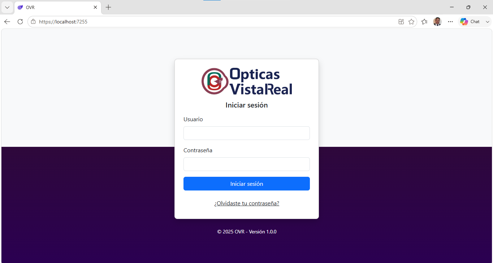

# Proyecto OVR

## Descripción

Proyecto demostrativo desarrollado con Blazor WebAssembly y ASP.NET Core Web API.

La solución implementa una arquitectura N-Capas (N-Tier Architecture), separando claramente la presentación, la lógica de negocio y el acceso a datos para facilitar el mantenimiento y la escalabilidad.

## Tecnologías

- C#
- .NET
- Blazor WebAssembly
- ASP.NET Core Web API
- API Controllers
- SQL Server
- REST API
- JavaScript

## Arquitectura

La solución está organizada en diferentes capas y proyectos:

- **Ovr.BlazorApp** – Aplicación cliente desarrollada con Blazor WebAssembly.
- **Ovr.ClientServices** – Servicios para consumir la API.
- **Ovr.ServiceAPI** – API REST desarrollada con ASP.NET Core.
- **Ovr.Domain** – Entidades y lógica de negocio.
- **Ovr.DAO** – Acceso a datos.
- **Ovr.Core.Infrastructures** – Componentes de infraestructura.

## Objetivo

Este repositorio forma parte de mi portafolio profesional y tiene fines demostrativos para mostrar el desarrollo de aplicaciones empresariales utilizando .NET y Blazor.
